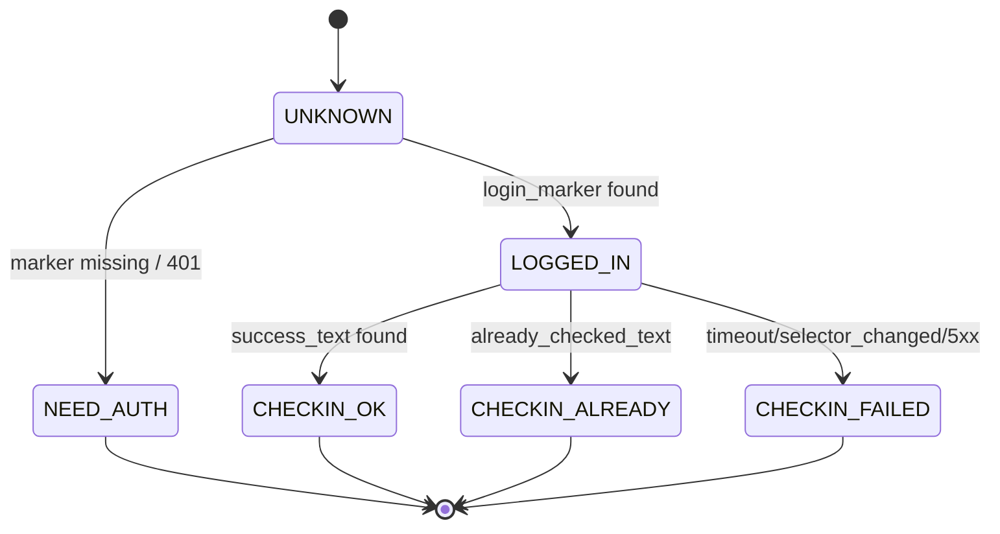

# AnyRouter 自动签到（MVP）
## 功能说明
开发一个每天定时登录https://anyrouter.top/打卡签到。这个网站第一次登录通过github授权登录的，后续浏览器可以根据cookie以及认证信息自动登录。我们就是要开发一个模拟浏览器自动登录。我的想法第一次要考虑playwright来手动通过github授权的方式登录https://anyrouter.top网站，注意这里是通过github账号登录授权才能登录https://anyrouter.top。

**方案：持久化用户目录 + systemd/cron 调度 + 单文件配置 + 邮件通知聚合**

> 目标：在本机或轻量服务器稳定执行每天 3 次签到；当日**首次成功**只发一封成功邮件，**失败**则每次都发告警邮件；仅支持**单 GitHub 账号**；采用 Playwright 复用\*\*持久化用户目录（user-data-dir）\*\*以最大化稳定性。

---

## 1. 范围与共识（MVP 边界）

* **站点**：`https://anyrouter.top/`
* **登录方式**：首次人工通过 **GitHub OAuth** 登录；后续全靠**持久化会话**自动登录（不做账号密码托管）。
* **执行频次（默认）**：每天 **08:30 / 12:30 / 20:30**（时区：**Europe/Helsinki**）。
* **通知策略**：

  * 当日**首次成功** → **仅发一次成功邮件**；
  * **任一失败** → **立即发失败邮件**（附失败截图/摘要）。
* **账号数**：单账号（不做多租户）。
* **数据安全**：MVP 不做本地加密（与共识一致），仅做**文件权限与日志脱敏**。
* **持久化**：

  * 会话：`./data/userdata/`（Chromium 用户目录），或备选 `storageState`。
  * 历史：`history.csv`（**环切保留** N 条，默认 1000）。
  * 日志：按天/大小轮转。
* **调度**：优先 **systemd timer**；备选 **cron**。
* **人工介入**：仅通过**邮件**。

---

## 2. 交付与成功标准

* **交付物**：

  1. 可运行的 Python 脚本集（`authorize.py / signin.py` 等）；
  2. `config.toml`；
  3. `systemd` 单元与定时器文件；
  4. README（安装/授权/调度/故障排查）。
* **成功标准**：

  * 7 天内\*\*≥ 95%\*\* 签到成功率；
  * 当日成功邮件**最多 1 封**；失败时**必有**告警邮件与截图；
  * 选择器变更或会话失效能给出**明确错误码与恢复指引**。

---

## 3. 功能需求（MVP）

### 3.1 登录与会话

* **首次授权（人工）**：打开 headed 浏览器 → GitHub OAuth → 写入 `./data/userdata/`。
* **后续登录（自动）**：复用 `user-data-dir` 启动上下文并检测登录态（依据页面特征而非仅 Cookie 存在）。
* **会话健康**：若检测未登录 → 标记 `NEED_AUTH` 并返回清晰提示（需重新执行首次授权流程）。

### 3.2 签到执行

* 进入签到页 → 定位签到触发控件（多策略：role/text/locator） → 执行点击/提交。
* **结果判定**：依据显式成功提示 / 当日已签到标识；保障**幂等**（同日成功后不重复上报成功）。

### 3.3 调度执行

* **systemd timer** 在设定时刻调用一次 `signin.py`；
* **失败重试**：单次任务内**指数退避**最多 3 次（1s/4s/9s）。

### 3.4 通知聚合（仅邮件）

* **成功**：当日首次成功才发（落地“成功日戳”）；
* **失败**：每次失败都发，须包含 **错误码、摘要、截图**。
* SMTP 直发（`smtplib`），支持 SSL/TLS。

### 3.5 数据与日志

* `history.csv`：记录（时间、结果、错误码、耗时、重试次数、run\_id 等），**环切保留**；
* 日志（JSON 行）：结构化字段便于 grep/聚合；失败附 `screenshots/*.png`。
* 可选 `trace.zip`（仅在开启调试时生成）。

---

## 4. 非功能需求（MVP 级）

* **稳定性**：显式等待 + 智能选择器；失败重试；超时可配。
* **安全性**：最低权限（600/700）；日志脱敏（邮箱打码、Token 不落盘）。
* **可维护性**：关键选择器/文案统一由 `config.toml` 管理；错误码标准化。

---

## 5. 配置（单文件 `config.toml`）

```toml
# 时区与调度（用于 systemd/cron 文档与应用内日志标注）
timezone = "Europe/Helsinki"

# 默认每日三次
[schedule]
times = ["08:30", "12:30", "20:30"]  # 24h 格式，本地时区

# 通知策略
[notify]
enable_email = true
success_email_once_per_day = true
email_on_failure_always = true

# SMTP（示例：Gmail/企业邮局）
[notify.smtp]
host = "smtp.example.com"
port = 465
use_ssl = true              # 若改用 StartTLS，则 use_ssl=false, use_starttls=true
use_starttls = false
username = "bot@example.com"
password = "YOUR_APP_PASSWORD"
from = "AnyRouter Bot <bot@example.com>"
to = ["ops@example.com"]    # 支持多收件人

# 运行参数
[run]
headless_preferred = true   # 首次失败时自动回退到 headed 再试一次
nav_timeout_ms = 20000
action_timeout_ms = 15000
max_retries = 3             # 指数退避：1s/4s/9s
keep_history_rows = 1000

# 站点与选择器（可随站点改动而仅改配置）
[site]
base_url = "https://anyrouter.top/"
signin_path = "/"
login_marker_text = "Sign out"      # 已登录判定的稳定特征之一（示例，按真实页面调整）
checkin_button_text = "签到"         # 触发控件的关键字/文本
checkin_success_text = "签到成功"     # 成功提示文本（或状态徽标）
already_checked_text = "今日已签到"   # 幂等标识

# 高级定位（可选：用 role/name/selector 兜底）
[selectors]
checkin_button_locator = ""         # 为空则走 by_text/role 策略
user_avatar_locator = ""
success_banner_locator = ""
```

---

## 6. 软件架构

### 6.1 总体结构（MVP）

```
┌──────────────┐        ┌────────────────┐
│ systemd/cron │ ───▶── │  signin.py     │
└──────────────┘        └──────┬─────────┘
                                │
            ┌───────────────────┼───────────────────┐
            ▼                   ▼                   ▼
     Playwright Ctx       状态与选择器封装       通知（邮件）
 (user-data-dir 复用)     (登录/签到判定)       (聚合策略/截图)
            │                   │                   │
            ▼                   ▼                   ▼
        history.csv           logs/*.log        screenshots/*.png
```

### 6.2 状态机（登录/签到）



### 6.3 模块划分（MVP 精简）

```
anyrouter-auto/
├─ src/
│  ├─ authorize.py        # 首次授权（headed，写入 user-data-dir）
│  ├─ signin.py           # 复用会话执行签到（带重试/通知/持久化）
│  ├─ state_check.py      # 登录/签到判定与选择器封装
│  ├─ notifier_email.py   # SMTP 发送（成功聚合/失败即时）
│  ├─ config.py           # 解析 config.toml + 默认值
│  ├─ logging_setup.py    # JSON 行日志 + 轮转
│  └─ utils.py            # 截图、时间戳、环切 history
├─ data/
│  ├─ userdata/           # Chromium 用户数据目录（核心）
│  ├─ history.csv
│  └─ logs/
├─ screenshots/
├─ config.toml
├─ systemd/
│  ├─ anyrouter.service
│  └─ anyrouter.timer
└─ README.md
```

**CLI 约定（示例）**

* `python src/authorize.py` → 打开 headed 浏览器，手工完成 GitHub OAuth；关闭后持久化会话即可。
* `python src/signin.py` → 运行一次签到任务（由 systemd/cron 调用）。

---

## 7. 关键流程

### 7.1 首次授权

1. `python src/authorize.py`（**headed**） → 跳转 `anyrouter.top` → 触发 **GitHub OAuth** → 完成 2FA/SSO/验证 → 关闭浏览器；
2. 生成/更新 `./data/userdata/`；
3. 记录 `history.csv`：`AUTH_OK`。

### 7.2 日常签到（每次触发）

1. 以 `user-data-dir` 启动（优先 headless）；
2. **登录态检测**：存在登录标识 → 进入签到页；否则标记 `NEED_AUTH`（邮件提示“请重新授权”）；
3. 定位签到控件（多策略：`get_by_role`/`get_by_text`/fallback locator）；
4. 点击并等待结果；解析成功/已签到/失败；
5. 失败则重试（指数退避）；如仍失败 → 截图 + 邮件；
6. 成功则写入**日戳**，当日后续成功不再发成功邮件。

---

## 8. 调度部署

### 8.1 systemd（推荐）

**`systemd/anyrouter.service`**

```ini
[Unit]
Description=AnyRouter Auto Check-in (one-shot)
Wants=network-online.target
After=network-online.target

[Service]
Type=oneshot
WorkingDirectory=/opt/anyrouter-auto
ExecStart=/usr/bin/python3 /opt/anyrouter-auto/src/signin.py
User=youruser
Group=youruser
Environment=PYTHONUNBUFFERED=1
# 确保时区一致（如有需要）
Environment=TZ=Europe/Helsinki
```

**`systemd/anyrouter.timer`**

```ini
[Unit]
Description=Run AnyRouter Check-in at 08:30, 12:30, 20:30 (Europe/Helsinki)

[Timer]
OnCalendar=Mon..Sun 08:30
OnCalendar=Mon..Sun 12:30
OnCalendar=Mon..Sun 20:30
Persistent=true
Unit=anyrouter.service

[Install]
WantedBy=timers.target
```

**启用**

```bash
sudo cp systemd/anyrouter.* /etc/systemd/system/
sudo systemctl daemon-reload
sudo systemctl enable --now anyrouter.timer
sudo systemctl list-timers | grep anyrouter
```

### 8.2 cron（备选）

```bash
# Europe/Helsinki 本地机设置好 /etc/timezone 或在脚本内设 TZ
30 8,12,20 * * * /usr/bin/python3 /opt/anyrouter-auto/src/signin.py >> /opt/anyrouter-auto/data/logs/cron.out 2>&1
```

---

## 9. 数据与日志

### 9.1 `history.csv`（示例字段）

```
ts,run_id,stage,result,error_code,retry_count,duration_ms,notes
2025-09-24T08:30:05+03:00,af23...,AUTH,AUTH_OK,,0,12450,"首次授权完成"
2025-09-24T12:30:07+03:00,b1c9...,CHECKIN,CHECKIN_OK,,1,5830,"success_text detected"
```

### 9.2 日志（JSON 行）

* 字段：`ts, level, run_id, step, action, selector, result, error_code, retry, duration_ms, url`
* 失败时保存：`./screenshots/{ts}_{run_id}.png`（可选 `trace.zip`）。

---

## 10. 错误码与告警邮件

| 错误码                | 说明       | 常见原因                       | 操作建议                     |
| ------------------ | -------- | -------------------------- | ------------------------ |
| `NEED_AUTH`        | 会话失效/未登录 | Cookie 过期、组织 SSO、GitHub 风控 | 重新执行 `authorize.py`      |
| `NAV_TIMEOUT`      | 页面加载超时   | 网络不稳、站点慢                   | 增加超时/重试，检查网络             |
| `SELECTOR_CHANGED` | 元素定位失败   | 前端改版                       | 更新 `config.toml` 中选择器/文本 |
| `CAPTCHA`          | 人机校验拦截   | 频率过高、反自动化                  | 降频、改用 headed、引入等待        |
| `RATE_LIMIT`       | 限流       | 访问过于密集                     | 增加间隔、重试退避                |
| `HTTP_5XX`         | 服务器错误    | 站点异常                       | 重试、观察趋势                  |
| `UNKNOWN`          | 未归类异常    | —                          | 截图、查日志、补规则               |

**失败邮件内容建议**

* 标题：`[AnyRouter][FAIL][{error_code}] {YYYY-MM-DD HH:mm}`
* 正文：时间、错误码、摘要、重试次数、最后 URL、建议下一步；附件：截图。

**成功邮件内容建议**

* 标题：`[AnyRouter][OK] {YYYY-MM-DD}`（当日仅 1 封）
* 正文：本次耗时、是否经历重试、最近 7 天成功率小结（可选）。

---

## 11. 验收用例（必须通过）

1. **首次授权**：`authorize.py` 执行后，`./data/userdata/` 生成，`history.csv` 有 `AUTH_OK`。
2. **单次成功**：`signin.py` 成功 → `CHECKIN_OK`，并在当日首次发送成功邮件。
3. **同日重复成功不再发**：当日再次 `signin.py`，若判定 `CHECKIN_ALREADY`，不再发送成功邮件。
4. **失败重试**：模拟选择器失效 → 3 次重试仍失败 → 发失败邮件 + 截图，`error_code=SELECTOR_CHANGED`。
5. **会话失效**：清空 `userdata` → 执行 → 返回 `NEED_AUTH` 告警邮件与恢复指引。
6. **历史环切**：当 `history.csv` 超过阈值（如 1000）后，最旧记录被截尾。
7. **调度恢复**：重启机器后 `systemd timer` 能按时触发；`Persistent=true` 能补跑因关机错过的任务（在允许范围内）。

---

## 12. 风险与缓解

* **页面改版/文案变动** → 选择器与关键文本集中在 `config.toml`；支持多策略定位。
* **反自动化/限流** → 默认 headless，失败自动回退 headed；增加随机化等待与退避。
* **时区错配** → `config.toml`、`systemd` 与系统时区统一设为 `Europe/Helsinki`。
* **邮件投递失败** → SMTP 双配置（可选备用），失败时落盘待人工补发（MVP 可不做自动重投）。

---

## 13. 后续演进（MVP 稳定后再做）

* APScheduler 内嵌调度、多通道通知（Telegram/企业微信）、SQLite 统计/多账号、会话加密开关、Docker 镜像、GitHub Actions 备选执行链、可视化看板（近 30 天成功率）。

---

### 一页清单（你现在能直接用）

1. 填好 `config.toml`（SMTP、时间、选择器文本）。
2. `python src/authorize.py`（手动走一次 GitHub OAuth）。
3. `python src/signin.py`（本地试跑一次，观察 `history.csv` 与邮件）。
4. 安装 `systemd` 定时器（或 cron）。
5. 第一天观察 3 次执行：成功/失败邮件是否符合“聚合策略”。

